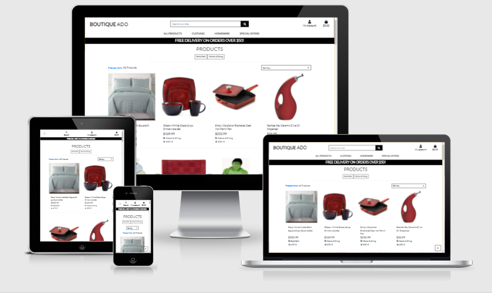

## Boutique Ado project
 A live demo can be found here: https://eva-kuk.github.io/boutique_ado_v1/

HOME PAGE

PRODUCTS PAGE

 ### Overview
 This project is a part of Full Stack Frameworks with Django framework module which I have learned during the tutorials at the Code Institute course. 
 The website is an e-commerce web application complete with product search and filter functionality. The project contains:
 - A live fully functional payment system.
 - A full-featured authentication system including email confirmation and user profiles.
 - A real-time notifications that guide the user's experience. 
The technologies used for this project:
- Srtipe, Amazon Web Services, Heroku, Python, Django Framework, HTML, CSS